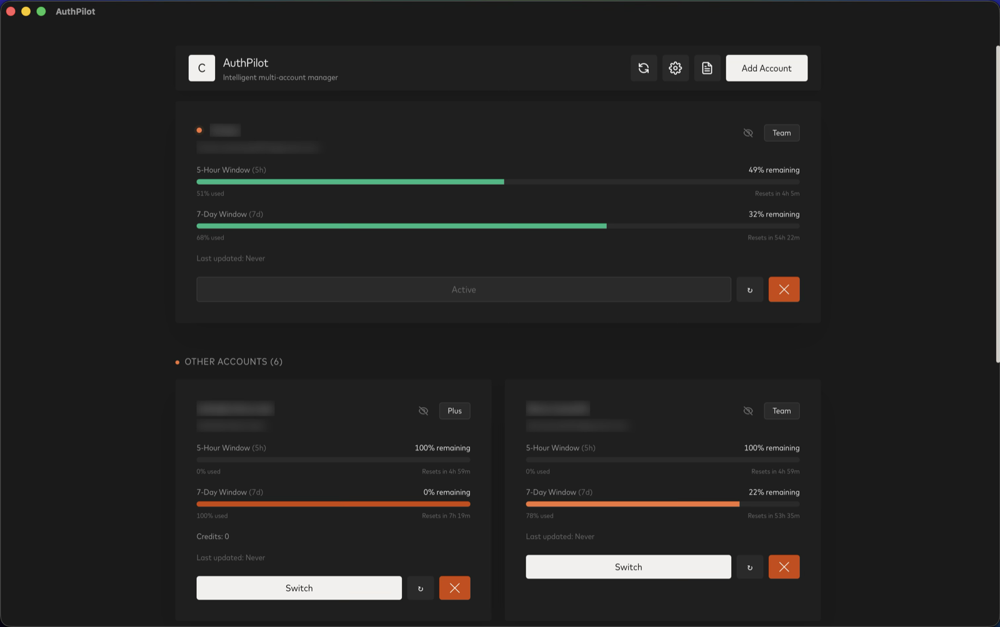

# AuthPilot

> Intelligent multi-account manager for OpenAI Codex CLI. Auto-switches accounts when usage limits are reached — never hit a rate limit again.

AuthPilot lives in your menu bar or system tray, silently monitors all your Codex accounts in the background, and automatically swaps to the healthiest account when limits approach. No more manual `auth.json` juggling.


## Screenshots



## Features

- **Tray-first desktop app** — Lives in the macOS menu bar, Windows tray, or Linux status area
- **Auto-switch on limit** — Monitors usage every 60s; switches accounts automatically when you hit configurable thresholds
- **Kill + relaunch Codex** — Seamlessly quits and restarts the Codex Desktop app on every switch so the new session is active immediately
- **Multiple auth modes** — Supports both ChatGPT OAuth login and direct API key import
- **Encrypted storage** — All account credentials are encrypted with XChaCha20-Poly1305 using a machine-bound key
- **Usage dashboard** — Open the dashboard anytime from the tray to see per-account usage, rate limits, and reset timers
- **Dark mode** — Native light/dark/system theme support
- **Zero-config file auth** — Automatically forces `cli_auth_credentials_store = "file"` in `~/.codex/config.toml`

## How it works

1. Add your Codex accounts via OAuth or by importing existing `auth.json` files
2. AuthPilot takes a snapshot of each account's credentials and stores them encrypted
3. The background monitor polls usage for all accounts every 60 seconds
4. When your active account approaches its limit, AuthPilot swaps `~/.codex/auth.json` with the next best account and restarts Codex

## Tech Stack

- **Backend:** Rust + Tauri v2
- **Frontend:** React 19 + TypeScript + Tailwind CSS v4
- **Security:** XChaCha20-Poly1305 + PBKDF2 encryption
- **Design:** Custom Mastercard Design System inspired styling

## Development

### Prerequisites

- [Rust](https://rustup.rs/)
- [Node.js](https://nodejs.org/) (v20+)
- [pnpm](https://pnpm.io/)
- macOS, Windows, or Linux

### Setup

```bash
# Clone the repo
git clone https://github.com/ibrar-x/auth-pilot.git
cd auth-pilot

# Install frontend dependencies
pnpm install

# Install Tauri CLI
cargo install tauri-cli

# Run in development mode
pnpm tauri dev

# Build for production
pnpm tauri build
```

The built app artifacts will be under:
```
src-tauri/target/release/bundle/
```

## CI/CD

This project uses GitHub Actions for:
- **CI** — Frontend type checking, Rust linting and tests on every PR
- **Build** — Cross-platform builds (macOS, Windows, Linux) on every push to main
- **Release** — Automated macOS, Windows, and Linux release publishing on version tags

See [`.github/workflows/`](.github/workflows/) for workflow definitions.

Release artifacts are unsigned unless signing and notarization secrets are configured in GitHub Actions.

## License

MIT License — see [LICENSE](LICENSE) for details.

---

**Note:** AuthPilot is an independent tool and is not affiliated with OpenAI.
